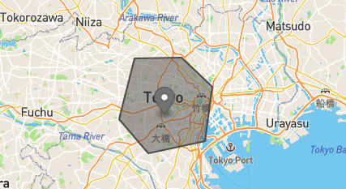

# Mozio Backend Task

Mozio Backend Potential hire Project 2.0

Goals: - demonstrate proficiency in Django/Python - build something that scales gracefully & is easily extensible - Write good API docs & Tests

Prompt:

As Mozio expands internationally, we have a growing problem that many transportation suppliers we'd like to integrate cannot give us concrete zipcodes, cities, etc that they serve. To combat this, we'd like to be able to define custom polygons as their "service area" and we'd like for the owners of these shuttle companies to be able to define and alter their polygons whenever they want, eliminating the need for mozio employees to do this boring grunt work.

We'd like you to build a JSON REST API to help us solve this problem. Create a Github account if you do not have one already and put all of your source code on github. Your project should have API endpoints to create, update, delete, and retreive information about providers. Batch operations are not necessary except for get. A provider should contain the following information:

- Name

- Email

- Phone Number

- Language

- Currency

Once a provider is created they should be able to start defining service areas. These service areas will be geojson polygons and should be stored in the database in a way that they can be retreived and queried upon easily. There should be endpoints to create, update, delete, and get a polygon. Batch operations are not necessary except for get. A polygon should contain a name and price as well as the geojson information.

You should create an API endpoint to query this data. It should take a lat/lng pair as arguments and return a list of all polygons that include the given lat/lng. The name of the polygon, provider's name, and price should be returned for each polygon. This operation should be FAST. Mozio has thousand of providers and hundreds of thousands of service areas.

All of this should be built in python/django. Use any extra libraries you think will help, choose whatever database you think is best fit for the task, and use caching as you see fit. Once you finish, write up some API docs (again using any tool you see fit) and make sure your code is well tested. Ensure that your code is clean, follows standard pep8 style (though you can use 120 characters per line) and has comments where appropriate.

Finally, deploy your code to a hosting service of your choice. Mozio is built entirely on AWS, so bonus points will be awarded for use of AWS.

## API Reference

#### Get all items

```http
  GET http://shiyanshirani-polygon.herokuapp.com/${parameter}
```

| Parameter  | Type     | Description                     |
| :--------- | :------- | :------------------------------ |
| `provider` | `string` | Retrieves each service provider |
| `polygon`  | `string` | Retrieves each polygon          |

#### Get items by `id`

```http
  GET http://shiyanshirani-polygon.herokuapp.com/${parameter}/${id}
```

| Parameter        | Type  | Description                              |
| :--------------- | :---- | :--------------------------------------- |
| `provider/${id}` | `int` | **Required**. `id` of item to be fetched |
| `polygon/${id}`  | `int` | **Required**. `id` of item to be fetched |

#### Get GeoPolygon

```http
  GET http://shiyanshirani-polygon.herokuapp.com/geopolygon/?lat={latitude}&long={longitude}
```

| Parameter   | Type    | Description                                           |
| :---------- | :------ | :---------------------------------------------------- |
| `latitude`  | `float` | **eg**. To check serivce provider in that area.       |
| `longitude` | `float` | **Required**. To check service provider in that area. |

Reference

> Tokyo's longitude and latitude - [[135.53009033203125, 35.40024478679507], [135.38726806640625, 35.16258214808429], [135.8624267578125, 35.24113278166642], [135.53009033203125, 35.40024478679507]]
> Point in Tokyo's Polygon - latitude=135.560302734375 & long=35.28374272801905

> Kyoto's longitude and latitude - [[139.625244140625, 35.862343734896484], [139.482421875, 35.46961797120201], [140.020751953125, 35.7286770448517], [139.625244140625, 35.862343734896484]]
> Point in Kyoto's Polygon - latitude=139.6307373046875 & long=35.661759419295045

## Output

This Django API will retrieve all the service providers located in that area (polygon) from the database.

## Explaination

Each vertices of the polygon is sent to the `api` in an nested list type of coordinate which is then stored in the database as a Polygon.

To `query` regarding a particular point(latitude, longitude) use `GET` method on GeoPolygon API reference to get all the service provider's information.



Reference - [geojson.io](https://geojson.io/#map=3/30.07/51.33)

## Run Locally

Clone the project

```console
 $ git clone https://github.com/shiyanshirani/Mozio-Backend-Task.git
```

Go to the project directory

```bash
 $ cd polygon_project
```

Install dependencies

```bash
 $ pip3 install -r requirements.txt
```

Start the server

```bash
 $ python3 manage.py makemigrations
 $ python3 manage.py migrate
 $ python3 manage.py runserver
```

## Deployment

```bash
 https://shiyanshirani-polygon.herokuapp.com
```

or

## [Polygon Project Live](<[Polygon](https://shiyanshirani-polygon.herokuapp.com/)>) - Heroku

I was unable to deploy it on AWS because of banking complications.

## Authors

- [@shiyanshirani](https://www.github.com/octokatherine)

## License

[MIT](https://choosealicense.com/licenses/mit/)
